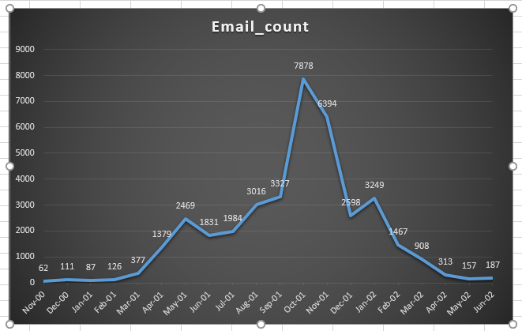
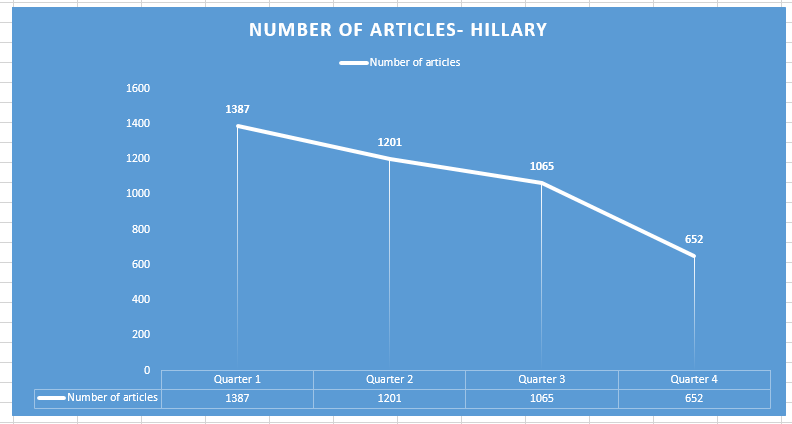

# Question 1:

## Enron Data Analysis:

### Data Used:
* The sent mails under the sent_items folder for each of the employees of the Enron Organization available under the mail directory is used for the analysis. The Glob function is used to fetch the path of all the sent mails and emails are fetched and read using email parser and fed in to a list.

#### Analysis 1:
* The first analysis is to get an idea of the email exchanges done by the enron employees on monthly basis. The email count of sent items of each employee is aggregated and then its filtered for each month based on the date information available on the email.
* A dictionary is created with Month as key and email count as values and saved into a .csv file.

1) The email count was low from November 2000 to March 2001 and there is dramatic increase of emails from April 2001 which was 200% higher than the count of emails of previous month.

2) Again there was a increase of mails of 200% from September 2001 to Oct 2001.  7878 emails were sent during Oct 2001, when the legal counsel asked to destroy all the enron files except basic documents.

3) Then the number of emails sent started decreasing drastically and pattern was in decerasing phase till the month of June 2002.

#### Analysis2:
* Since most of the emails were sent during the months of September to December, the second analysis is to find the number of emails sent during the business and non-business hours.
* So analysis is made in such a way that the code filtered the number of emails sent during the four months then an if condition is added to filter the emails base on the timings. 8.00 a.m to 18 a.m is classified as Business hours and 19 a.m to 7 a.m is classified as non-business hours.

##### Dec: Business Hour Mails: 2000, Non Business Hour Mails: 709
##### Nov: Business Hour Mails: 4947, Non Business Hour Mails: 1509
##### Oct: Business Hour Mails: 6105, Non Business Hour Mails: 1773
##### Sep: Business Hour Mails: 2422, Non Business Hour Mails: 905

1) From the analysis we were able to infer that there were emails sent during non-business hours which was nearly 50 % of the count of emails sent during business hours.

2) The highest amount of non-business emails were sent during the month of October when the legal counsel asked to destroy all the enron files except basic documents.

#### Analysis3:
* As the above two analysis shows that most emails were sent during Sep-Dec and during Non-business hours, I decided to dig further by classifying the emails sent to enron account and non-enron accounts.

* So the code is written in such a way that first the month is filtered, then the emails sent to enron and non-enron accounts is classified and further the business and non-business emails classification done to the emails sent to both enron and non-enron accounts by creating various dictionary and using nested if else loop.

1) Most of the emails sent during non- business hours were sent to the non-enron accounts and it was during the month of October. This clearly explains the downfall of Enron Organization which actually started during the October Month of 2001.

# Question 2:

## New York Times API Data Analysis:

### Data Used:
* NYT Archives API
* NYT Article Search API

#### Data collection and Pre-processing:

##### Fetching the Data:

* The API requests are placed to the NYT Archives API based on search term "Hillary" and "Trump" and passing year and month parameters to fetch the articles published in new york times.

* The API requests are placed to the NYT Archives API based on the parameter of pages. The pages number were passed by iterating a for loop to fetch the articles from the archives. 

##### Post Process of data:

* The initial data fetched from both the api's are dumped into folder in the form of json files.

* Then the each and every article is extracted from the saved json files and saved as separate json files with unique ID and published date as names of the files.

##### NYT Article Search API analysis:

* Both the articles collected using the terms hillary and trump are filtered month wise from Jan 2016 to Dec 2016 and classified and then loaded into the dictionary.

* A new dictionary is created using Month as key and count of articles as values. The process is done for both hillary and trump articles.

* Then months are grouped into four quarters and new dictionary is created with quarters as keys and email counts and percenatge change as values. The percenatge change is calculated using the formula new_list1[i]-new_list1[i-1])/(new_list1[i-1]))*100.

 
 

1) The trend of number of articles in the name of hillary is a curve with a gradual decreasing pattern. The percenatge change from the quarter 1 to quarter 4 was decrasing with percenatge change of 13%, 11% and 38% respectively. There was a reasonable decraese in the fourth quarter as the elections were over.

2) But if you analyze the trend of number of articles in the name of trump , the curve is sinusoidal in nature with hump and dips, and there was significant percenatge change of article counts from quarter 3 to quarter 4. The percenatge drop or change was approximately 91.5% which is a major or drmatical drop.

3) This explains the reduction in the count of articles in the name of trump by crticizing him and also explains how he won the US presidentials election with negative correlation to the number of articles in NYT.

#### NYT Archives API analysis:

* The articles collected using the page parameter are filtered month wise from Jan 2016 to Dec 2016 and classified and then loaded into the dictionary.

*  A new dictionary is created using Month as key and count of articles as values. Then further another new dictionary created with month as key and kewords and artciles as key value pair, i.e nested dcitionary is created.

1) Most articles were published during the months of June to September and maximum articles were published during August.

2) The analysis is narrowed further by creating a new dictionary for only the articles published during the month of August 2016, with month as key and keywords and article count were values.

3) The Top 3 ranks were given to the articles related "US Presidential Elections" with count 719, "Presidential Election of 2016" with count 620 and "Presidential elections" with count of 464. So on Total 1803 articles were published on the August of 2016 on the topic of US presidential elections.

